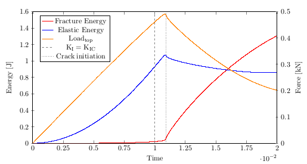

# Implementation and Analysis of a Phase-Field Model for Brittle Fracture

Phase-field approach for predicting fracture based failures in structures is gaining importance like never before. This approach is an elegant numerical technique which doesn’t require tracking of crack surfaces and allows to study crack branching and merging without much additional effort.

The research presented in this work focuses on numerical implementation of quasi-static brittle fracture for standard benchmark problems and analyzing the effects of various parameters like viscosity, regularization length and boundary conditions. For facilitating numerical implementation of the anisotropic formulation of phase field model, a unique expression for elasticity tensor has been derived. Three different modeling strategies for the pre-existing crack are presented
and a comparison is made between them considering the factors like time for crack initiation and maximum attainable force during simulation. We compare our implemented phase field model results with the linear elastic fracture mechanics (LEFM) for mode I loading for all three modeling strategies for pre-existing crack.

<!---This is a finite element code based in deal.II (C++) to simulate crack propagation in brittle materials using phase field model. 
The above project has been developed for a master thesis in FAU Erlangen-Nuremebrg. --->
Please refer to [**thesis-report**](doc/Singh_Thesis_Report.pdf) in order to understand the basic terms used in this project. Also, Algorithm-1 in section 3.3 is recommended to understand the overall flow of the program. The algorithm has been implemented within a finite element code written in C++, based on open source library deal.II

<!--- ---> 
<!--- 

*Figure: Single edge notched tension test (M<sub>I</sub>). Crack patterns for viscosity = 1 × 10<sup>−6</sup> kNs/mm<sup>2</sup>
at different displacements (u) for each regularization length (l)*--->

## Fracture Modes ##
We can classify external loads into three independent types, leading to a simplified scenario where the effect of each type can be determined individually.
* **Mode I** : Opening mode - This type of mode occurs when we have a tensile stress which is acting normal to the plane of crack. We get a symmetric crack opening in this case. 
* **Mode II** : Shearing mode - The applied stress is parallel to the plane of crack and is perpendicular to the leading edge of crack.
* **Mode III** : Tearing mode - In this mode, crack surfaces also separate in the plane of the crack but parallel to the leading edge of the crack.
<p align="center">
    
</p>

<p align=center> 
    <em> Figure 1: Modes of fracture.</em>
</p>

## Numerical Results ##
We perform the single edge notched tension test in a quasi-static setting for plane strain conditions. The resulting crack patterns at different displacements for can be seen in Fig. 2. Phase field variable *d = 1* denotes crack and *d = 0* means compact material.
<p align="center">
    
</p>
<p>
    <em align="center">Figure 2: Single edge notched tension test. Crack patterns for viscosity (η) = 1 × 10<sup>−6</sup> kNs/mm<sup>2</sup>
at different displacements (u) for regularization length (l) = 0.015 mm.</em>
</p>
Similarly, we perform the single edge notched shear test in the same conditions. The resulting crack patterns at different displacements for this case can be seen in Fig. 3.
<p align="center">
    
</p>
<p>
    <em align="center">Figure 3: Single edge notched shear test. Crack patterns for viscosity (η) = 1 × 10<sup>−6</sup> kNs/mm<sup>2</sup>
at different displacements (u) for regularization length (l) = 0.015 mm.</em>
</p>

## Comparison with LEFM analytical results ## 
Mode I fracture condition is implemented and it is shown that our phase field model gives correct results for the case of
LEFM also by showing that the crack initiation occurs when K<sub>I</sub> (Stress Intensity Factor) becomes equal to K<sub>IC</sub> (Fracture Toughness). We can observe a sudden increase in the curve of fracture energy and a drop in curves of elastic energy and force on top boundary at the point where crack initiation occurs. This point is significantly close to the theoretical point where K<sub>I</sub> becomes equal to K<sub>IC</sub>.  
<p align="center">
    
</p>
<p>
    <em align="center">Figure 4: Energy-time curve for elastic and fracture energy along with force-time curve on
secondary y-axis for regularization length (l) = 0.0075 mm and viscosity (η) = 0 kNs/mm<sup>2</sup>.</em>
</p>

## Parameter and Mesh file ##
In order to replicate the results in thesis-report, various parameter files have been added to folder named "parameter_files". 
- Detailed explanation of different types of meshes can be found [here](doc/Mesh.md). 
- You can find parameter files relation with thesis report figures [here](doc/Figures.md).
- Detailed explanation of variables to be given in parameter file is given [here](doc/Parameter.md). 


## How to run ##

You need to install deal.II (see <http://www.dealii.org>) from the official site or using spack (https://github.com/dealii/dealii/wiki/deal.II-in-Spack). 
Download the code and configure with:
```
  spack load dealii
```
```
  cd Thesis
  mkdir build
  cd build
  cmake ..
```
Compile with:
```
  make
```
and finally run with:
```
  ./pffsim /path/to/parameter/file
```

## Helpful material
For getting an overview of block solvers, multithreading, input parameter handling and linear newton system from non-linear equations, 
please refer to Step-44 of deal.II tutorials (https://dealii.org/9.0.0/doxygen/deal.II/step_44.html).

## Notes
- The code uses the deal.II 9.0.0 version. If project is run with newer versions, certain version specific modifications might need to be done.

