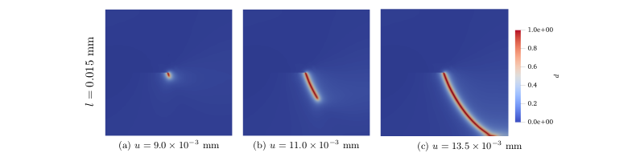

# Implementation and Analysis of a Phase-Field Model for Brittle Fracture

Phase-field approach for predicting fracture based failures in structures is gaining importance like never before. This approach is an elegant numerical technique which doesn’t require tracking of crack surfaces and allows to study crack branching and merging without much additional effort.

The research presented in this work focuses on numerical implementation of quasi-static brittle fracture for standard benchmark problems and analyzing the effects of various parameters like viscosity, regularization length and boundary conditions. For facilitating numerical implementation of the anisotropic formulation of phase field model, a unique expression for elasticity tensor has been derived. Three different modeling strategies for the pre-existing crack are presented
and a comparison is made between them considering the factors like time for crack initiation and maximum attainable force during simulation. We compare our implemented phase field model results with the linear elastic fracture mechanics (LEFM) for mode I loading for all three modeling strategies for pre-existing crack.

<!---This is a finite element code based in deal.II (C++) to simulate crack propagation in brittle materials using phase field model. 
The above project has been developed for a master thesis in FAU Erlangen-Nuremebrg. --->
Please refer to [**thesis-report**](doc/Singh_Thesis_Report.pdf) in order to understand the basic terms used in this project. Also, Algorithm-1 in section 3.3 is recommended to understand the overall flow of the program. The algorithm has been implemented within a finite element code written in C++, based on open source library deal.II

<!--- ---> 
<!--- 

*Figure: Single edge notched tension test (M<sub>I</sub>). Crack patterns for viscosity = 1 × 10<sup>−6</sup> kNs/mm<sup>2</sup>
at different displacements (u) for each regularization length (l)*--->

## Fracture Modes ##
We can classify external loads into three independent types, leading to a simplified scenario where the effect of each type can be determined individually.
* **Mode I** : Opening mode - This type of mode occurs when we have a tensile stress which is acting normal to the plane of crack. We get a symmetric crack opening in this case. 
* **Mode II** : Shearing mode - The applied stress is parallel to the plane of crack and is perpendicular to the leading edge of crack.
* **Mode III** : Tearing mode - In this mode, crack surfaces also separate in the plane of the crack but parallel to the leading edge of the crack.
<p align="center">
    
</p>
<p>
    <em align="center"> Figure 1: Modes of fracture</em>
</p>

## Numerical Results ##
For the Mode I case i.e. Tension mode, the resulting crack patterns at different displacements for regularization length (l) = 0.015 mm can be
seen in Fig. 2. The illustration uses the viscous model with viscosity (η) = 1 × 10<sup>−6</sup> kNs/mm<sup>2</sup>.
<p align="center">
    
</p>
<p>
    <em align="center">Figure: Single edge notched tension test. Crack patterns for viscosity = 1 × 10<sup>−6</sup> kNs/mm<sup>2</sup>
at different displacements (u) for each regularization length (l)</em>
</p>
<p align="center">
    
</p>
<p>
    <em align="center">Figure: Single edge notched shear test. Crack patterns for viscosity = 1 × 10<sup>−6</sup> kNs/mm<sup>2</sup>
at different displacements (u) for each regularization length (l)</em>
</p>

## Mesh file
In this nomenclature, we use three pre-existing crack modeling strategies: M_I, M_Id and P_I. Reader is referred to section 2.4 in thesis-report to understand the definition and basic differences between them. mesh01, mesh02, mesh03, mesh05 and mesh06 are generated with ABAQUS and are taken as input without any subsequent changes in them. Only change is in mesh04, which is also generated in ABAQUS but is then again refined using deal.II parameters of global and local refinements. Values of these global, local parameters and also height and length of refined areas could be found in respective parameter files of mesh04.

The mesh name nomenclature used in parameter files name is described below:
1. **mesh01** -> This mesh is used for M_I and M_Id type crack in **tension test** for benchmark problems and contains pre-refined mesh where crack is expected to grow with element size h = 0.001 mm (approx).(Tension_left_1.inp)
2. **mesh02** -> This mesh is used for P_I type crack in **tension test** for benchmark problems using method of single row of elements as a crack and contains pre-refined mesh where crack is to be prescribed as well as where the crack is expected to grow with element size h = 0.001 mm (approx).(Tension_left_10.inp)
3. **mesh03** -> This mesh is used for M_I type crack in **shear test** for benchmark problems and contains pre-refined mesh where crack is expected to grow with element size h = 0.002 mm (approx).(Shear_left_2.inp)
4. **mesh04** -> This mesh is used for M_I and M_Id type crack for lefm mode I scenarios and subsequent global and local refinement will be implemented in the program giving us a element size of h = 0.001 mm(approx).(Tension_left_lefm_1.inp)
5. **mesh05** -> This mesh is used for P_I type crack for lefm mode I scenarios using method of **single row of elements as a crack** and contains a pre-refined mesh where crack is to be prescribed and expected to grow with element size of h = 0.001 mm(approx).(Tension_left_lefm_2.inp)
6. **mesh06-01/02** -> This mesh is used for P_I type crack for **tension test** for benchmark problems using method of **single row of nodes as a crack**  and is refined appropriately with local and global refinement to get element sizes of h = 0.001 mm(**mesh06-01**)and h = 0.0007 mm (**mesh06-02**) respectively.(Tension_left_7.inp)  

## Parameter file
In order to replicate the results in thesis-report, various parameter files have been added to folder named "parameter_files". 
We will take an example and explain the meaning of that parameter file. 
"**M_I_Tension_l-0.015_v-0_mesh01_uxbfxd-uxtfree.prm**":
1. **M_I** -> It denotes the pre-existing crack modeling strategy. (**M_I** | **M_Id** | **P_I**)
2. **Tension** -> It shows the type of test begin performed on the specimen. (**Tension** | **Shear** | **lefm**)
3. **l-0.015** -> Regularization length (**0.015** | **0.0075**)
4. **v-0** -> Viscosity (**0** | **1e-6** | **1e-5** | **0.5e-4**)
5. **mesh01** -> Corresponding mesh file name.
6. **uxbfxd-uxtfree** -> **Optional** parameter showing boundary conditions for tension test. If not mentioned, **uxbfxd-uxtfree** is assumed. (**uxbfxd-uxtfxd** | **uxbfxd-uxtfree** | **uxbfree-uxtfree**)

- You can find parameter files relation with thesis report figures [here](doc/Figures.md)
- Detailed explanation of variables to be given in parameter file is given [here](doc/Parameter.md) 


## How to run

You need to install deal.II (see http://www.dealii.org) from the official site or using spack (https://github.com/dealii/dealii/wiki/deal.II-in-Spack). 
Download the code and configure with:
```
  spack load dealii
```
```
  cd Thesis
  mkdir build
  cd build
  cmake ..
```
Compile with:
```
  make
```
and finally run with:
```
  ./pffsim /path/to/parameter/file
```

## Helpful material
For getting an overview of block solvers, multithreading, input parameter handling and linear newton system from non-linear equations, 
please refer to Step-44 of deal.II tutorials (https://dealii.org/9.0.0/doxygen/deal.II/step_44.html).

## Notes
- The code uses the deal.II 9.0.0 version. If project is run with newer versions, certain version specific modifications might need to be done.

