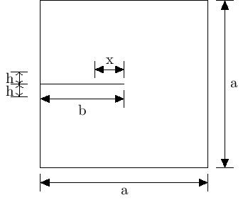

# Geometry
- **Mesh File**-> Path of the mesh file to be read.
- **Global Refinement**-> Refinement of the whole mesh. Only required in lefm cases of M_I and M_Id. Other mesh files are already refined at areas expecting crack propagation.
- **Local Refinement**-> Refinement near crack areas only. Only required in lefm cases of M_I and M_Id.
- **Grid scale**-> Scaling parameter for the input mesh files. In our case, input ABAQUS meshes are scaled 1000 times smaller with help of this parameter.
- **Plate dim**-> Dimension of the side of input geometry (square) in mm (denoted as "a" in figure attached below). 
- **Crack length**-> Length of the pre-existing crack in the body in mm (denoted as "b"). 
- **Ref region height perc**-> Refinement region height percentage: Input parameter as a percentage of Plate dim. Only required in lefm cases of M_I and M_Id. This height("h") is defined as length of the area above or below crack which will be refined. So total height of refined area will be 2h. 
- **Crack tip back ref perc**-> Crack tip back refinement percentage:(denoted as "x"): Input parameter as a percentage of crack length. Only required in lefm cases of M_I and M_Id. This length is defined as the length of the refined area in the back of the crack tip. This parameter ensures that crack tip is surrounded by fine mesh from every direction and that refinement doesn't start abruptly from crack tip. 

.

# Material
- **Lambda**-> Lame parameter for assigning material properties.
- **Mu**-> Lame parameter for assigning material properties.

# FE System
- **Finite element degree**->  Polynomial degree of the finite elements.
- **Quad order**-> Quadrature order (maximal degree of polynomials integrated exactly.)

# Newton Raphson
- **Max newton iterations**-> Maximum number of iterations allowed for the Newton method to converge.
- **Residual tolerance u**-> Convergnece criteria for displacement: If residual values goes below this limit, solution is assumed to be converged. 
- **Residual tolerance d**-> Residual tolerance limit for phase field.
- **Newton update tolerance u**-> Tolerance limit for newton loop for linearizing displacement.

# Linear Solver
- **CG Solver tolerance**-> Tolerance limit of Conjugate Gradient Solver.
- **Relaxation parameter**-> Relaxation parameter for Conjugate Gradient Solver.

# Time
- **Starting time**-> Start time of the time loop.
- **End time**-> End time of the time loop.
- **Delta time initial**-> Initial increment step size for time loop.
- **Delta time final**-> Final increment step size for time loop.(Applicable in tension test for benchmark problems only)
- **Time change point**-> Time at which increment step size changes.(Applicable in tension test for benchmark problems only)
- **Time tolerance**-> Tolerance limit for time loop.
- **Output frequency**-> Frequency with which visualization files are generated.
- **Time adaptivity**-> If true, then in case of non-convergence, this option will decrease the time step size until convergence is achieved.
- **Alpha**-> Factor with which time step size is decreased.
- **Beta**-> Multiplied with delta time initial, this factor decides the lower limit for time step size.

# PhaseField
- **Critical energy release rate**-> Griffith's constant.
- **Length scale parameter**-> Regularization length.
- **Small positive parameter**-> Parameter used along degradation function appearing in positive cauchy stress formula.
- **Total displacement**-> Total displacement to which specimen is subjected.
- **Viscosity**-> Provides additional stabilization to the numerical solution procedure. Values considered in this work are 0 Ns/mm^2,1e-3 Ns/mm^2,1e-2 Ns/mm^2,0.5e-1 Ns/mm^2.  

# TestCase
- **Test case**-> Parameter which decides whether test being run is tension or shear. Possible options are **tension** and **shear**. Only applicable for **benchmarks** problem type.

# BoundaryConditions
- **Tension x axis bottom**-> Boundary condition for bottom boundary in x-axis for tension test. Possible options are **fixed** and **free**. Applicable to all cases of pre-existing crack- M_I, M_Id and P_I for benchmark problems.
- **Tension x axis top**-> Boundary condition for top boundary in x-axis for tension test. Possible options are **fixed** and **free**. Applicable to all cases of pre-existing crack- M_I, M_Id and P_I for benchmark problems.

# ModelingStrategy
- **Initial crack strategy**-> Pre-existing crack modeling strategy. Possible options are **M_I**, **M_Id** and **P_I**.
- **Problem type**-> Whether we are solving standard benchmark problems or LEFM. Possible options are **benchmarks** and **lefm_mode_I**.
- **Target factor fracture toughness**-> Applicable for lefm only. Decides upto what value of K_IC should the time loop run. So for example, a value of 2 would mean we will be running the simulation until K_I becomes 2*K_IC. 
- **Target steps fracture toughness**-> Applicable for lefm only. Decides the number of steps in which K_I should reach value of K_IC.